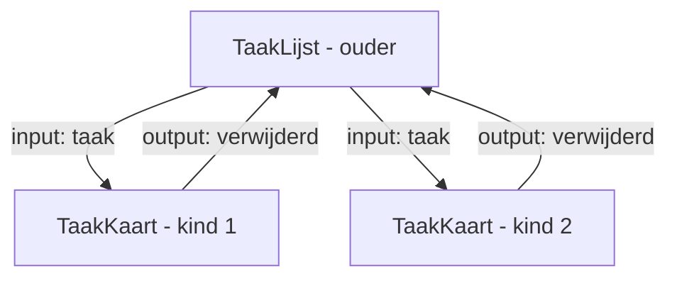

<span class="badge-niveau">Niveau: gevorderd beginner</span>

# 5. Componentcommunicatie

Grote schermen splits je op in kleinere componenten (bv. `taak-lijst`
bevat meerdere `taak-kaart`-components). Die moeten met elkaar kunnen
praten: data naar beneden doorgeven, en gebeurtenissen naar boven melden.

## `input()` — data van ouder naar kind

```typescript
// taak-kaart.ts
import { Component, input } from '@angular/core';

interface Taak {
  id: number;
  titel: string;
  status: 'open' | 'bezig' | 'klaar';
}

@Component({
  selector: 'app-taak-kaart',
  imports: [],
  templateUrl: './taak-kaart.html',
  styleUrl: './taak-kaart.css',
})
export class TaakKaart {
  taak = input.required<Taak>();
  // ^ "input()" is de MODERNE manier (Angular 17.1+), een signal-based
  //   functie i.p.v. de oude @Input()-decorator. ".required<Taak>()"
  //   betekent: dit veld MOET meegegeven worden door de ouder, en moet
  //   van het type Taak zijn. Zonder ".required" mag het ontbreken
  //   (dan geef je een default mee, bv. input<Taak | null>(null)).
}
```

```html
<!-- taak-kaart.html -->
<div class="kaart">
  <h3>{{ taak().titel }}</h3>
  <!-- ^ LET OP: taak is nu een SIGNAL, geen gewone property. Je moet
       het dus AANROEPEN als functie: taak() — niet taak.titel zonder
       de haakjes. Dit is een veelgemaakte examenfout. -->
  <p>Status: {{ taak().status }}</p>
</div>
```

```html
<!-- gebruik in de ouder, bv. taak-lijst.html -->
<app-taak-kaart [taak]="eenTaak"></app-taak-kaart>
<!-- ^ [taak] is een property binding (Hoofdstuk 4) die de waarde van
     "eenTaak" (een gewone property in taak-lijst.ts) doorgeeft aan de
     "taak"-input van het kindcomponent. De naam MOET overeenkomen met
     hoe het input-veld heet in de class (hier: "taak"). -->
```

## `output()` — een gebeurtenis van kind naar ouder

```typescript
// taak-kaart.ts (uitgebreid)
import { Component, input, output } from '@angular/core';

@Component({ /* ... zoals hierboven ... */ })
export class TaakKaart {
  taak = input.required<Taak>();

  verwijderd = output<number>();
  // ^ "output()" is de moderne vervanger van @Output() + EventEmitter.
  //   <number> zegt: dit event stuurt een number mee (het id).

  opVerwijderKlik(): void {
    this.verwijderd.emit(this.taak().id);
    // ^ "emit()" verstuurt het event naar de ouder, met het id als data.
    //   De ouder beslist WAT er dan gebeurt — het kind weet dat niet.
  }
}
```

```html
<!-- taak-kaart.html (uitgebreid) -->
<div class="kaart">
  <h3>{{ taak().titel }}</h3>
  <button (click)="opVerwijderKlik()">Verwijder</button>
</div>
```

```typescript
// taak-lijst.ts (ouder)
export class TaakLijst {
  taken: Taak[] = [ /* ... */ ];

  verwijderTaak(id: number): void {
    this.taken = this.taken.filter(t => t.id !== id);
  }
}
```

```html
<!-- taak-lijst.html (ouder) -->
@for (taak of taken; track taak.id) {
  <app-taak-kaart
    [taak]="taak"
    (verwijderd)="verwijderTaak($event)">
  </app-taak-kaart>
  <!-- ^ [taak]="taak"        -> geeft de taak-data DOORWAARTS
       (verwijderd)="..."    -> luistert naar het event OPWAARTS
       $event                -> bevat wat het kind meegaf via emit()
                                 (hier: het id, een number) -->
}
```

!!! tip "Onthoud de richting"
    - `input()` = **naar beneden** (ouder → kind): data.
    - `output()` = **naar boven** (kind → ouder): gebeurtenissen.
    - Een kind past NOOIT rechtstreeks data van de ouder aan — het stuurt
      altijd een event, en de ouder beslist wat ermee gebeurt. Dit
      voorkomt dat je door je hele app heen niet meer weet waar data
      verandert.

## Waarom niet gewoon alles in één groot component?



Kleine, herbruikbare componenten zijn makkelijker te testen, te
hergebruiken (bv. `taak-kaart` ook tonen in een detailpagina), en te
begrijpen. Dit patroon zie je terug in je examenproject: `ticket-card`
is een kind van `ticket-list`/`ticket-board`.

## Zelf proberen

1. Maak `taak-kaart` als los, herbruikbaar component met `input.required`
   voor de taak.
2. Voeg een `output()` toe voor "markeer als klaar" (stuur het id door).
3. Laat `taak-lijst` de status bijwerken wanneer dat event binnenkomt.

Door naar **Hoofdstuk 6: Services & Dependency Injection**.
