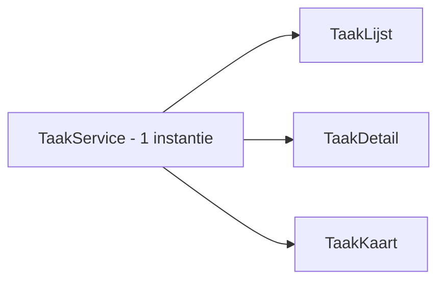

<span class="badge-niveau">Niveau: gevorderd beginner</span>

# 6. Services & Dependency Injection

## Het probleem dat services oplossen

Zonder services zou elk component zelf data moeten ophalen, bewaren en
delen. Twee componenten die dezelfde data nodig hebben (bv. `taak-lijst`
én `taak-detail`) zouden dan elk hun eigen, losstaande kopie hebben —
onmogelijk synchroon te houden.

**Services** centraliseren logica en data, los van de UI. Componenten
"vragen" een service via **Dependency Injection (DI)**: je hoeft zelf
geen `new TaakService()` te schrijven, Angular regelt dat voor je.

## Een service aanmaken

```bash
ng generate service services/taak
# ^ maakt src/app/services/taak.service.ts aan.
```

```typescript
// taak.service.ts
import { Injectable } from '@angular/core';

interface Taak {
  id: number;
  titel: string;
  status: 'open' | 'bezig' | 'klaar';
}

@Injectable({
  providedIn: 'root',
  // ^ "root" betekent: er bestaat maar ÉÉN instantie van deze service
  //   voor de hele app (een singleton). Alle componenten die hem
  //   injecteren, delen dezelfde data. Dit is de meest gebruikte optie.
})
export class TaakService {
  private taken: Taak[] = [
    { id: 1, titel: 'Angular leren', status: 'bezig' },
  ];
  // ^ "private": enkel toegankelijk binnen deze service. Componenten
  //   mogen de lijst niet rechtstreeks aanpassen, enkel via methodes
  //   hieronder — dat houdt de logica op één plek.

  getTaken(): Taak[] {
    return this.taken;
  }

  voegToe(titel: string): void {
    const nieuweTaak: Taak = {
      id: Date.now(),
      // ^ eenvoudige (niet-perfecte) manier om een uniek id te genereren
      //   voor lokale testdata — in het echt komt het id van de backend.
      titel,
      status: 'open',
    };
    this.taken = [...this.taken, nieuweTaak];
  }

  verwijder(id: number): void {
    this.taken = this.taken.filter(t => t.id !== id);
  }
}
```

## De service injecteren in een component

```typescript
// taak-lijst.ts
import { Component, inject } from '@angular/core';
import { TaakService } from '../services/taak.service';

@Component({
  selector: 'app-taak-lijst',
  imports: [],
  templateUrl: './taak-lijst.html',
  styleUrl: './taak-lijst.css',
})
export class TaakLijst {
  private taakService = inject(TaakService);
  // ^ "inject()" is de MODERNE manier (Angular 14+) om DI te gebruiken,
  //   i.p.v. het via de constructor te doen. Functioneel identiek,
  //   maar leesbaarder buiten de constructor. Je examenproject
  //   (ticket.service.ts) gebruikt nog de constructor-vorm:
  //   constructor(private http: HttpClient) {} — beide zijn correct,
  //   inject() is gewoon de nieuwere stijl.

  taken = this.taakService.getTaken();
  // ^ haalt de huidige lijst op bij het aanmaken van dit component.
}
```

!!! note "Constructor-injectie (de vorm die je in je examenproject ziet)"
    ```typescript
    constructor(private http: HttpClient) {}
    // ^ "private http: HttpClient" is een SHORTCUT: dit declareert
    //   tegelijk een private property "http" ÉN vult die in met de
    //   geïnjecteerde HttpClient. Angular ziet de type-hint
    //   (HttpClient) en weet zo wat het moet injecteren.
    ```
    Beide manieren (`inject()` en constructor-parameters) doen exact
    hetzelfde. Gebruik gerust wat je project al gebruikt — mixen kan,
    maar consistentie is netter.

## Waarom dit zo belangrijk is voor je examen



Omdat een service met `providedIn: 'root'` een singleton is, zien
`taak-lijst` én `taak-detail` altijd **dezelfde** data. Verwijder je een
taak in de lijst, dan is die ook meteen weg als je naar het detail
navigeert — zonder dat je zelf iets hoeft te synchroniseren.

!!! warning "Logica in een component zetten die in een service hoort"
    Een veelgemaakte fout: HTTP-calls of data-manipulatie rechtstreeks in
    een component schrijven. Dat werkt technisch, maar zodra een tweede
    component dezelfde data nodig heeft, moet je alles verplaatsen. Zet
    data-logica dus meteen in een service, ook als je (nog) maar één
    component hebt.

## Zelf proberen

1. Maak `TaakService` zoals hierboven, met `getTaken()`, `voegToe()`,
   `verwijder()`.
2. Injecteer hem in zowel `taak-lijst` als een nieuw `taak-detail`
   component, en toon in beide dezelfde data.
3. Verwijder een taak vanuit `taak-lijst` en controleer dat die ook uit
   `taak-detail` verdwijnt na een herlaad van dat component.

Door naar **Hoofdstuk 7: HTTP & Observables** — waar de data niet langer
hardcoded is, maar van een echte backend komt.
