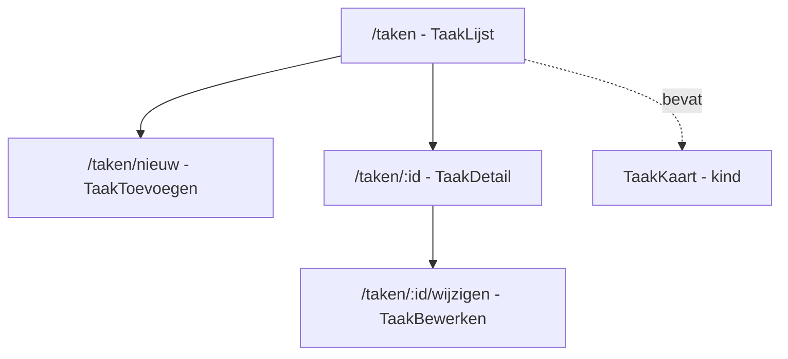

<span class="badge-niveau">Niveau: samenvattend</span>

# 11. Praktijkcase: Takenplanner

Dit hoofdstuk brengt alles samen in één klein, volledig werkend project.
Bouw dit zelf na — **niet copy-pasten**, maar per stukje typen en
uitproberen. Dit is een eigen oefenproject, bewust een andere "casus"
(taken i.p.v. tickets) dan je examenproject, zodat je de concepten zelf
moet toepassen in plaats van herkennen.

## Wat je bouwt



Model:

```typescript
// models/taak.model.ts
export type TaakStatus = 'open' | 'bezig' | 'klaar';

export interface Taak {
  id: number;
  titel: string;
  omschrijving?: string;
  prioriteit: number; // 1-5
  status: TaakStatus;
}
```

## Stap 1 — projectstructuur opzetten

```bash
ng new takenplanner
cd takenplanner
ng g interface models/taak
ng g service services/taak
ng g component tickets/taak-lijst
ng g component tickets/taak-kaart
ng g component tickets/taak-detail
ng g component tickets/taak-toevoegen
ng g component tickets/taak-bewerken
ng g component niet-gevonden
# ^ elk commando genereert de boilerplate uit de vorige hoofdstukken.
#   Doe dit bewust ÉÉN voor ÉÉN en bekijk telkens wat er gegenereerd werd.
```

## Stap 2 — de service (Hoofdstuk 6 & 7)

```typescript
// services/taak.service.ts
import { Injectable, inject } from '@angular/core';
import { HttpClient } from '@angular/common/http';
import { Observable } from 'rxjs';
import { Taak } from '../models/taak.model';

@Injectable({ providedIn: 'root' })
export class TaakService {
  private http = inject(HttpClient);
  private baseUrl = 'http://localhost:3000';

  getTaken(): Observable<Taak[]> {
    return this.http.get<Taak[]>(`${this.baseUrl}/taken`);
  }
  getTaakById(id: number): Observable<Taak> {
    return this.http.get<Taak>(`${this.baseUrl}/taken/${id}`);
  }
  voegToe(taak: Omit<Taak, 'id'>): Observable<Taak> {
    return this.http.post<Taak>(`${this.baseUrl}/taken`, taak);
  }
  bijwerken(id: number, taak: Partial<Omit<Taak, 'id'>>): Observable<Taak> {
    return this.http.put<Taak>(`${this.baseUrl}/taken/${id}`, taak);
  }
  verwijder(id: number): Observable<void> {
    return this.http.delete<void>(`${this.baseUrl}/taken/${id}`);
  }
}
```

## Stap 3 — routing (Hoofdstuk 8)

```typescript
// app.routes.ts
import { Routes } from '@angular/router';
import { TaakLijst } from './tickets/taak-lijst/taak-lijst';
import { TaakDetail } from './tickets/taak-detail/taak-detail';
import { TaakToevoegen } from './tickets/taak-toevoegen/taak-toevoegen';
import { TaakBewerken } from './tickets/taak-bewerken/taak-bewerken';
import { NietGevonden } from './niet-gevonden/niet-gevonden';

export const routes: Routes = [
  { path: 'taken', component: TaakLijst },
  { path: 'taken/nieuw', component: TaakToevoegen },
  // ^ vóór ':id' — anders vangt ':id' dit pad ook op (Hoofdstuk 8).
  { path: 'taken/:id/wijzigen', component: TaakBewerken },
  { path: 'taken/:id', component: TaakDetail },
  { path: '', redirectTo: '/taken', pathMatch: 'full' },
  { path: '**', component: NietGevonden },
];
```

```typescript
// app.config.ts
import { ApplicationConfig } from '@angular/core';
import { provideRouter, withComponentInputBinding } from '@angular/router';
import { provideHttpClient } from '@angular/common/http';
import { routes } from './app.routes';

export const appConfig: ApplicationConfig = {
  providers: [
    provideRouter(routes, withComponentInputBinding()),
    provideHttpClient(),
  ],
};
```

## Stap 4 — TaakLijst + TaakKaart (Hoofdstuk 3, 4, 5)

```typescript
// tickets/taak-lijst/taak-lijst.ts
import { Component, inject, OnInit } from '@angular/core';
import { TaakKaart } from '../taak-kaart/taak-kaart';
import { TaakService } from '../../services/taak.service';
import { Taak } from '../../models/taak.model';

@Component({
  selector: 'app-taak-lijst',
  imports: [TaakKaart],
  // ^ TaakKaart wordt hier gebruikt, dus MOET het hier geïmporteerd
  //   worden (standalone-regel, zie Hoofdstuk 3).
  templateUrl: './taak-lijst.html',
  styleUrl: './taak-lijst.css',
})
export class TaakLijst implements OnInit {
  private taakService = inject(TaakService);
  taken: Taak[] = [];
  laden = true;

  ngOnInit(): void {
    this.taakService.getTaken().subscribe(data => {
      this.taken = data;
      this.laden = false;
    });
  }

  verwijderTaak(id: number): void {
    this.taakService.verwijder(id).subscribe(() => {
      this.taken = this.taken.filter(t => t.id !== id);
      // ^ lokaal de UI bijwerken na een geslaagde delete-call, zodat
      //   je niet de hele lijst opnieuw moet ophalen.
    });
  }
}
```

```html
<!-- tickets/taak-lijst/taak-lijst.html -->
<h2>Mijn taken</h2>
<a routerLink="/taken/nieuw">+ Nieuwe taak</a>

@if (laden) {
  <p>Bezig met laden...</p>
} @else {
  @for (taak of taken; track taak.id) {
    <app-taak-kaart [taak]="taak" (verwijderd)="verwijderTaak($event)">
    </app-taak-kaart>
  } @empty {
    <p>Nog geen taken — voeg er eentje toe!</p>
  }
}
```

## Stap 5 — formulieren (Hoofdstuk 9)

```typescript
// tickets/taak-toevoegen/taak-toevoegen.ts
import { Component, inject } from '@angular/core';
import { FormGroup, FormControl, Validators, ReactiveFormsModule } from '@angular/forms';
import { Router } from '@angular/router';
import { TaakService } from '../../services/taak.service';

@Component({
  selector: 'app-taak-toevoegen',
  imports: [ReactiveFormsModule],
  templateUrl: './taak-toevoegen.html',
  styleUrl: './taak-toevoegen.css',
})
export class TaakToevoegen {
  private taakService = inject(TaakService);
  private router = inject(Router);

  form = new FormGroup({
    titel: new FormControl('', {
      nonNullable: true,
      validators: [Validators.required, Validators.minLength(3)],
    }),
    prioriteit: new FormControl(3, { nonNullable: true }),
    status: new FormControl<'open' | 'bezig' | 'klaar'>('open', {
      nonNullable: true,
    }),
  });

  versturen(): void {
    if (this.form.invalid) {
      this.form.markAllAsTouched();
      return;
    }
    this.taakService.voegToe(this.form.getRawValue()).subscribe(() => {
      this.router.navigate(['/taken']);
    });
  }
}
```

## Checklist voordat je verder gaat

- [ ] `ng serve` draait zonder foutmeldingen in de terminal
- [ ] `/taken` toont de lijst (of een lege-staat bij `@empty`)
- [ ] Een taak toevoegen via `/taken/nieuw` werkt en stuurt je terug naar
      `/taken`
- [ ] Klikken op een taak brengt je naar `/taken/:id` met de juiste data
- [ ] Verwijderen werkt zowel in de backend als visueel in de lijst
- [ ] Een onbestaande URL toont je "niet gevonden"-pagina

Werkt dit allemaal? Dan beheers je de volledige basis die ook je
examenproject (ticket-app) vereist. Ga nu naar **Hoofdstuk 12:
Examentips & valkuilen** voor de laatste check.
